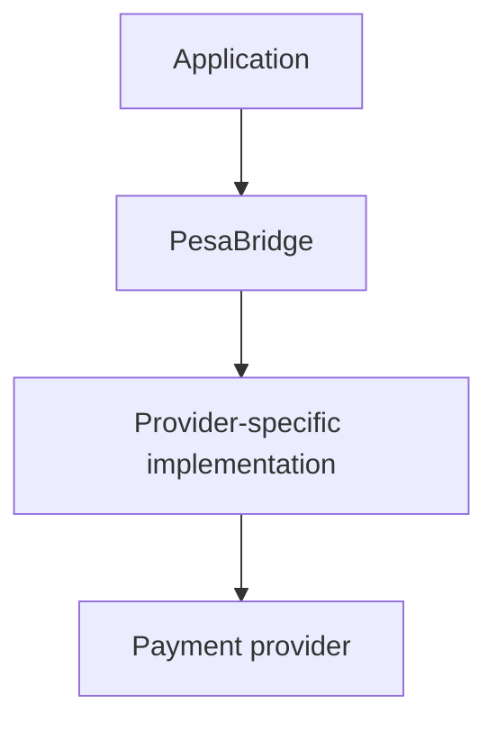
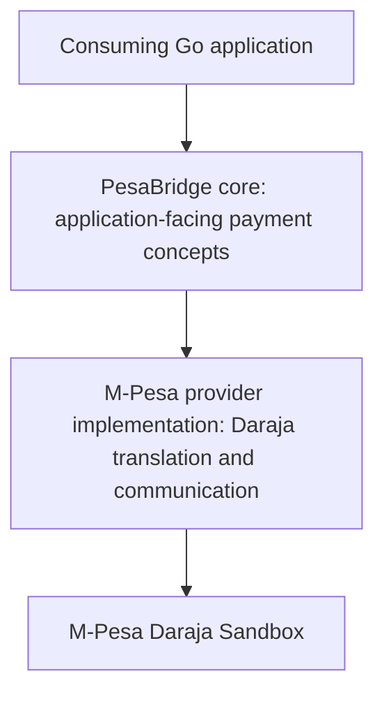
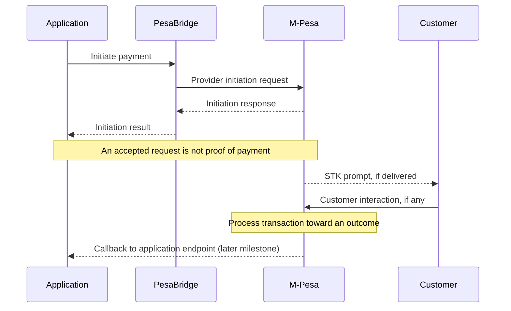

# PesaBridge Design

This document describes the initial direction for PesaBridge, a learning-focused Go payment library. It is a design proposal, not an implemented API or a statement of production readiness. **The first milestone is sandbox authentication and STK Push initiation.** Callback processing and final payment status are later milestones.

## 1. Overview

PesaBridge is an open-source Go library intended to make Kenyan payment integrations easier to understand and reuse. It will encapsulate provider-specific HTTP communication, authentication, and request/response handling so that consuming applications can concentrate on their own payment workflows.

The project exists primarily to learn payment infrastructure through a small, working integration. Its initial users are Go developers who need to connect their applications to Kenyan payment providers, including developers learning how payment APIs differ from ordinary synchronous APIs.

M-Pesa is the starting point because it directly matches the project's Kenyan payment focus and provides a concrete Daraja Sandbox target. Starting with one provider and one operation keeps the learning loop manageable: understand authentication, construct a request, send it, and interpret the result before attempting broader abstractions.

PesaBridge belongs in an independent library rather than being embedded directly into an application such as Loopi. Provider communication should be reusable without importing an application's order model, database, frontend, or business rules. Other Go applications should be able to consume PesaBridge independently.

PesaBridge is not initially a payment processor, gateway, hosted payment platform, merchant dashboard, or financial system that holds or moves funds itself. It helps applications communicate with providers; those providers execute the payment operations.

## 2. Problem Statement

Payment providers expose different APIs, authentication mechanisms, request and response formats, error structures, payment states, and webhook or callback mechanisms. Applications must understand these differences to construct valid requests and correctly interpret outcomes.

Without a reusable integration layer, each application repeats provider-specific code: obtaining tokens, assembling payloads, handling HTTP failures, extracting identifiers, and distinguishing an accepted request from a completed payment. Fixes and security improvements must then be repeated across applications.

The intended relationship is:



PesaBridge should offer a simpler developer-facing interface while encapsulating provider-specific complexity. Simplicity must not erase meaningful differences between providers or imply guarantees the provider does not offer. Application concerns, such as deciding when an order may be fulfilled, remain with the application.

## 3. Learning Objectives

The project intentionally uses payment integration as a practical learning exercise. Areas of study include:

- **HTTP API integration:** constructing requests, interpreting responses, and managing connections and cancellation.
- **Authentication and access tokens:** supplying credentials, obtaining tokens, understanding expiry, and avoiding credential exposure.
- **Request/response modeling:** representing required data and preserving relevant provider information without exposing every transport detail.
- **Payment lifecycle and transaction states:** distinguishing initiation, pending work, final outcomes, and unknown outcomes.
- **Asynchronous systems and callbacks/webhooks:** receiving information after the initiating call has returned.
- **Idempotency:** understanding repeated attempts and which layer can prevent repeated effects.
- **Error handling:** distinguishing transport, authentication, provider API, and payment failures.
- **Security:** protecting credentials and sensitive payment data while validating external input.
- **Retries and timeouts:** bounding waits and recognizing when retrying could repeat a payment operation.
- **Testing external integrations:** separating deterministic local checks from sandbox-dependent verification.
- **Provider abstraction:** discovering shared concepts through working implementations.
- **Observability:** understanding requests and outcomes through useful, redacted diagnostics.
- **CI/CD:** learning automated validation and, later, release practices.
- **Eventual deployment:** learning how consuming applications and callback receivers operate; a Go library itself does not require a hosted service.

These are learning objectives across the project's lifetime, not a list of v0.1 deliverables. Abstractions should follow actual requirements. A complex multi-provider framework would add assumptions before the project has enough evidence to validate them.

## 4. Target Users

The initial user is a Go developer building an application that needs to integrate with Kenyan payment providers.

The following illustrates a possible developer experience. **It is a conceptual target API, not an implementation or a final API contract.** Names, construction, configuration, result fields, and error behavior remain undecided.

```go
client := pesabridge.NewClient(config)

response, err := client.Payments.Create(ctx, pesabridge.PaymentRequest{
    Amount:           100,
    PhoneNumber:      "2547XXXXXXXX",
    AccountReference: "ORDER-123",
    Description:      "Order payment",
})
```

This example expresses an application's intent to initiate a payment. It does not establish amount units, currency handling, phone validation rules, or what constitutes a successful response. In particular, a successful initiation response must not be interpreted as proof that the customer has paid.

## 5. Initial Scope: v0.1

### Provider

M-Pesa only.

### Environment

Daraja Sandbox only. Sandbox verification does not establish production readiness.

### Operation

STK Push initiation only.

### Initial capabilities

- Configuration of sandbox credentials and required provider settings.
- Authentication with Daraja Sandbox.
- Access-token handling sufficient for authenticated requests, with expiry behavior established through research.
- STK Push request construction according to verified provider requirements.
- STK Push response parsing, including information needed to identify the initiation attempt.
- Basic request validation based on documented constraints.
- Basic error handling that preserves useful context without exposing secrets.
- Unit testing of local logic.
- HTTP-level testing using controlled responses.
- Sandbox integration testing of actual provider communication.

**Definition of done:** a Go application can use PesaBridge to authenticate against the M-Pesa sandbox and successfully initiate a sandbox STK Push. Evidence should include deterministic tests and an explicit sandbox integration run whose response is interpreted according to verified Daraja documentation.

Successful initiation means the provider reports acceptance or initiation according to its documented contract. It does not mean the customer received a prompt, approved payment, or completed payment. v0.1 does not require implementing callback processing, storing transactions, or determining final payment status.

If Daraja requires a callback URL or other externally supplied setting even for initiation, configuration must accommodate the verified requirement. This does not expand v0.1 into a hosted callback receiver; the exact sandbox prerequisite is a Phase 2 research question.

## 6. Explicitly Out of Scope for v0.1

- Airtel Money, Pesapal, Flutterwave, and other providers.
- Refunds, B2C, and C2B operations.
- Transaction reconciliation.
- Production credentials and production deployment.
- A payment dashboard or frontend.
- A persistent transaction database.
- Kafka, Redis, and microservices.
- A payment orchestration platform.
- Callback processing and final payment-status management.

Some items may become future work; others may remain responsibilities of consuming applications. None should force infrastructure or public abstractions into the initial implementation prematurely.

## 7. Conceptual Architecture



These boxes describe responsibilities, not a required package layout, interface hierarchy, or set of Go types.

The **application** owns its business workflow: orders, customer experience, fulfillment decisions, and any storage it needs. It supplies configuration and payment intent to the library.

The **core** should eventually contain genuinely provider-independent concepts, such as the intent to initiate a payment and application-level correlation. The exact representation of amounts, identifiers, results, and errors must be established through implementation and comparison with later providers.

The **provider implementation** owns translation into the provider's protocol, authentication details, HTTP communication, and interpretation of provider responses. Daraja concepts to investigate include `BusinessShortCode`, `Password`, `Timestamp`, `PartyA`, `PartyB`, `CheckoutRequestID`, and `MerchantRequestID`. Their exact meanings, requirements, and handling must be verified during research rather than inferred from their names.

Such concepts should not unnecessarily leak into a generic payment request. However, hiding all provider information would also be harmful: provider configuration and returned correlation identifiers may need to remain accessible for operation and diagnosis. How they are exposed is undecided. A provider-specific detail should not become a mandatory field for every future provider merely because M-Pesa needs it.

No provider interfaces or Go types are specified at this stage. A straightforward first integration can establish these boundaries without introducing a general framework.

## 8. Core Design Principle

> Provider-specific complexity belongs inside provider implementations; provider-independent concepts belong in the core.

This principle should allow a later provider to change its authentication or payload format without forcing unrelated changes on consumers. Shared concepts should carry meanings that actually hold across providers.

There is also a risk in applying the principle too early: with only M-Pesa implemented, a supposedly generic abstraction may simply rename Daraja fields. A second working provider will provide evidence about which operations and states genuinely align. Until then, keep boundaries understandable and changes inexpensive rather than promising universal compatibility.

## 9. Payment Lifecycle

**Payment initiation is not payment completion.** The following is a conceptual learning flow, not a verified guarantee of Daraja event ordering, delivery, or customer behavior:



The distinctions to preserve are:

| Concept | Meaning in this design |
| --- | --- |
| Request accepted | The provider has accepted an initiation request according to its API contract. |
| STK prompt initiated | A prompt-related step has been initiated; acceptance alone does not prove delivery or display. |
| Customer interaction | The customer takes an action, if any; this is separate from the initiating HTTP exchange. |
| Payment processing | The provider is working toward a transaction outcome. |
| Payment completed | A successful final outcome is established using verified provider semantics. |
| Payment failed | A payment-level unsuccessful outcome is established using verified provider semantics. |
| Callback received | The application has received an asynchronous message; receipt alone does not establish authenticity or success. |

These are conceptual distinctions, not a proposed state enumeration or a promise that every step is separately observable. Callback payloads, delivery guarantees, ordering, verification options, and final-state rules remain research subjects.

v0.1 focuses on initiation. Callback handling and final status are the next major milestone. Until those are implemented and verified, applications must not use an initiation response as a basis for marking an order paid.

## 10. Security Principles

### Initial project requirements

These are requirements adopted by PesaBridge, not claims about provider guarantees:

- Never hardcode credentials. Supply them through configuration, including environment-derived configuration when appropriate.
- Never commit secrets, including sandbox credentials, captured headers, or credential-bearing fixtures.
- Never log access tokens or expose provider credentials through errors.
- Avoid logging sensitive payment information unnecessarily. Phone numbers and payment references require deliberate handling and redaction.
- Validate inputs before sending requests, using verified constraints rather than invented restrictions.
- Use HTTPS for external provider communication and preserve certificate verification.
- Keep diagnostics useful without including raw secret-bearing requests or responses.

### Future considerations

When callbacks are implemented, protect callback endpoints, validate incoming messages, and consider replay attacks. The available authenticity mechanisms must be researched; this document does not assume Daraja supplies a particular signature scheme.

Consider credential rotation and how applications replace credentials or invalidate cached authentication state. Production use will require a separate security review of configuration, access, logging, and operational practices. These considerations do not introduce a secret-management service or callback infrastructure into v0.1.

## 11. Error Handling Philosophy

The library should eventually distinguish failures well enough for consumers to choose an appropriate response:

| Category | Example concern |
| --- | --- |
| Configuration | Missing credentials or required sandbox settings. |
| Validation | An invalid or incomplete payment request. |
| Authentication | Failure to obtain or use an access token. |
| Network | Failure to establish or maintain communication. |
| Timeout | A configured deadline expires before the outcome is known. |
| Provider API | The provider rejects a request or returns a response that cannot be interpreted. |
| Payment/business | The payment reaches an unsuccessful business outcome. |

“The API request failed” and “the payment itself failed” describe different events. A timeout can leave the request outcome unknown: the application may have lost the response after the provider received the request. Conversely, an accepted initiation request may later lead to an unsuccessful payment.

Errors should provide enough context for diagnosis while protecting credentials and sensitive data. v0.1 needs basic distinctions relevant to initiation; final Go error types, normalization rules, and callback-related errors remain undecided.

## 12. Reliability Principles

Payment systems must not assume that receiving an HTTP response means the payment lifecycle is complete.

The design should develop the following practices as requirements become concrete:

- **HTTP timeouts:** bound external waits and respect application cancellation. Exact defaults are undecided.
- **Retries:** distinguish transient communication failures from safe-to-repeat operations. Do not blindly retry payment initiation after an ambiguous result.
- **Idempotency:** investigate provider support and application responsibilities before promising duplicate prevention. An account reference is not assumed to be an idempotency key.
- **Duplicate callbacks:** future handling must consider repeated delivery without repeating business effects.
- **Asynchronous processing:** callback processing should integrate with application workflows without assuming everything finishes in the initiating call.
- **Transaction correlation:** preserve the identifiers needed to connect application intent, provider initiation, and later events; verify their semantics first.
- **Eventual consistency:** represent uncertainty when local knowledge and the provider's state differ.
- **Reconciliation:** later investigate how to resolve missing or conflicting outcomes using supported provider mechanisms.

These are design concerns, not implemented guarantees. v0.1 should have bounded requests and clear errors; durable deduplication, automatic retry policy, callback processing, and reconciliation are not initial capabilities. Their design must follow verified provider behavior and actual application needs.

## 13. Testing Strategy

### Unit tests

Test pure logic without external calls: validation, request construction, timestamp/password generation where required by the verified protocol, and response parsing. Use synthetic values and documented expectations. Time-dependent logic should be controllable so tests do not depend on wall-clock timing.

### HTTP tests

Use mocked HTTP servers to exercise communication under controlled conditions:

- Successful authentication and initiation responses.
- Authentication failures.
- Malformed or incomplete responses.
- Provider API errors.
- Timeouts and cancellation.

Check both what is sent and how responses are interpreted. Verify that sensitive data does not escape into errors. These tests establish local behavior, not real provider compatibility.

### Sandbox integration tests

Use real Daraja Sandbox credentials supplied securely at run time to verify authentication and actual initiation communication. Keep these tests separate from deterministic unit and HTTP tests, with an explicit opt-in mechanism to be decided during implementation.

Sandbox tests depend on credentials, connectivity, provider availability, and verified sandbox prerequisites. They should not run as an implicit dependency of ordinary local tests or require secrets from outside contributors. Record redacted evidence of initiation success without presenting it as proof of a completed payment or production compatibility.

## 14. Development Strategy

| Phase | Focus | Intended result |
| --- | --- | --- |
| 1 | Problem and design | Agree on purpose, boundaries, and unresolved questions. |
| 2 | Research Daraja STK Push | Verify official authentication, fields, sandbox setup, response meanings, callback prerequisites, and error behavior. |
| 3 | Implement authentication | Obtain and handle sandbox access tokens with clear errors. |
| 4 | Implement STK Push | Construct, send, and parse an initiation request. |
| 5 | Add tests | Complete unit, HTTP, and explicit sandbox verification for v0.1. |
| 6 | Implement callback handling | Understand and represent asynchronous results and final status. |
| 7 | Harden reliability and security | Address observed failure modes, ambiguity, replay concerns, and operational needs. |
| 8 | Introduce a second provider | Learn which concepts differ through another concrete integration. |
| 9 | Extract and validate multi-provider abstractions | Refine shared behavior using evidence from both providers. |
| 10 | Release a stable library | Establish a documented, tested public contract suitable for v1.0. |

Tests should accompany implementation in Phases 3 and 4; Phase 5 completes the milestone's coverage rather than postponing all verification. Basic security and timeouts also belong in the first working integration; Phase 7 deepens them as the lifecycle grows.

Architecture should evolve from observed requirements rather than speculation. This document completes design work only: it does not authorize implementation, dependencies, release automation, deployment configuration, or changes to existing CI.

## 15. Repository and Project Philosophy

PesaBridge will live in its own repository and remain independent of consuming applications.

```text
Loopi      = payment application/product
PesaBridge = reusable payment infrastructure/library

Loopi ──depends on──> PesaBridge
```

Loopi may eventually consume PesaBridge as a dependency, but PesaBridge must not depend on Loopi. Loopi-specific order handling, persistence schemas, UI decisions, and deployment choices must not become library prerequisites.

The project is named PesaBridge. The Go module/import path remains to be selected.

## 16. Versioning Philosophy

The initial intention is to use semantic versioning. During `v0.x`, the public API may evolve as the project learns from real integrations. Experimental status should be explicit, and breaking changes should still be explained so early consumers can migrate.

`v1.0` should represent a stable public API with documented behavior and an understood support scope. After that, breaking public API changes should be treated seriously and reflected in versioning, including Go module versioning requirements when applicable.

Provider implementations should be able to evolve internally without unnecessarily breaking consumers. If an upstream change affects observable behavior, that impact must be assessed and communicated even if the library's function signatures remain the same.

Release automation and exact compatibility policies are not configured or finalized here.

## 17. Future Direction

The following are possibilities, not current requirements or commitments:

- Additional M-Pesa operations: C2B, B2C, transaction status, and refunds where supported and verified.
- Airtel Money, Pesapal, Flutterwave, and other relevant providers.
- Normalized payment status and errors where the meanings genuinely align.
- Webhook/callback handling and application integration patterns.
- Idempotency support with clearly defined guarantees and responsibilities.
- Reconciliation for missing, ambiguous, or conflicting outcomes.
- Observability through redacted diagnostics and suitable integration hooks.
- Multiple language SDKs or an HTTP API if the project eventually evolves beyond a Go library.

Each expansion needs its own requirements and provider research. An HTTP service or multiple SDKs would change the project's operational scope and should be an explicit decision, not an accidental consequence of adding providers.

## 18. Non-Goals

Initially, PesaBridge is not a payment processor, payment gateway, hosted payment platform, merchant dashboard, or custodian of funds. It is not an application framework, financial ledger, or payment orchestration platform. It does not aim to normalize every provider feature before establishing one working sandbox integration.

## 19. Open Design Questions

- What should the final public API look like, and how should initiation results express uncertainty?
- What should a provider interface look like, and when is one actually needed?
- Which payment concepts can genuinely be normalized across providers?
- Which provider-specific concepts should remain exposed, and how?
- How should amounts, currency, phone numbers, and references be represented and validated?
- What Daraja Sandbox prerequisites, including callback URL requirements, must be met for initiation testing?
- How should callbacks be represented, validated, and correlated with initiation attempts?
- Should transaction persistence belong in the library, remain with applications, or be supported through optional integration points?
- How should idempotency be exposed, and what guarantees can each provider actually support?
- How should retries be handled when the result of an earlier request is unknown?
- What token expiry, caching, refresh, and concurrency behavior is needed?
- What Go module path and supported Go versions should be adopted?
- Should PesaBridge remain a library or eventually evolve into a hosted payment service?
- What is the correct abstraction boundary after adding a second provider?

These questions will be answered through documented research, implementation, and experimentation rather than guessed upfront. The immediate next step is to research Daraja authentication and STK Push requirements within the sandbox-only v0.1 boundary.
